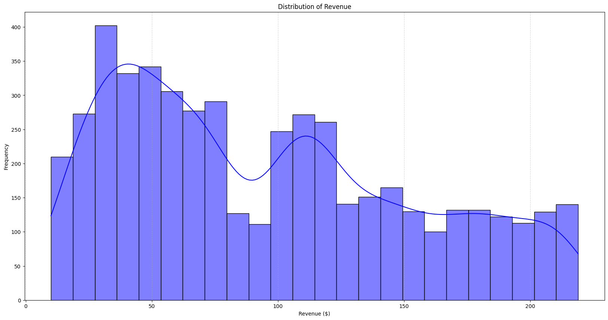

# RFM-Analysis

- This project uses RFM (Recency, Frequency, Monetary) analysis to segment customers based on their purchasing behavior. The goal is to identify patterns in customer activity and provide insights for targeted marketing strategies.

- This project analyzes historical transaction data to group customers based on how recently and frequently they purchase, and how much they spend. 

- The output segments help identify loyal customers, at-risk groups, and high-value targets for retention or marketing campaigns.

---

**1. Problem Statement:** Businesses often struggle to understand customer behavior in large transaction datasets. RFM analysis provides a data-driven way to segment customers and make targeted decisions.

**2. Data Summary**
- Source: Online retail dataset  
- Size: 4,900+ transactions  
- Key columns: `CustomerID`, `InvoiceDate`, `InvoiceNo`, `Amount`

**3. Exploratory Data Analysis (EDA)**

- **Distribution of Revenue**
     
---

- **Orders Number by Month**
     

**4. Customer Segmentation Using RFM**

Classify our customers based on the individual recency, frequency and monetary scores.

- **Compute RFM Metric** 
     - Each customer is scored based on:
          - Recency: How recently they made a purchase
          - Frequency: How often they purchase
          - Monetary: How much they spend

- **Customers Classification**
     

- **RFM Histogram**
     

- **Customer Segments Distribution**
     

- **Median Recency by Segment**
     

- **Median Frequency by Segment**
     

- **Median Recency by Segment**
     

- **5. Recommendation**
     - Target Champions and Loyal Customers with special rewards  
     - Re-engage At-Risk and Hibernating segments using promotions  
     - Ignore Lost Customers if reactivation cost is too high